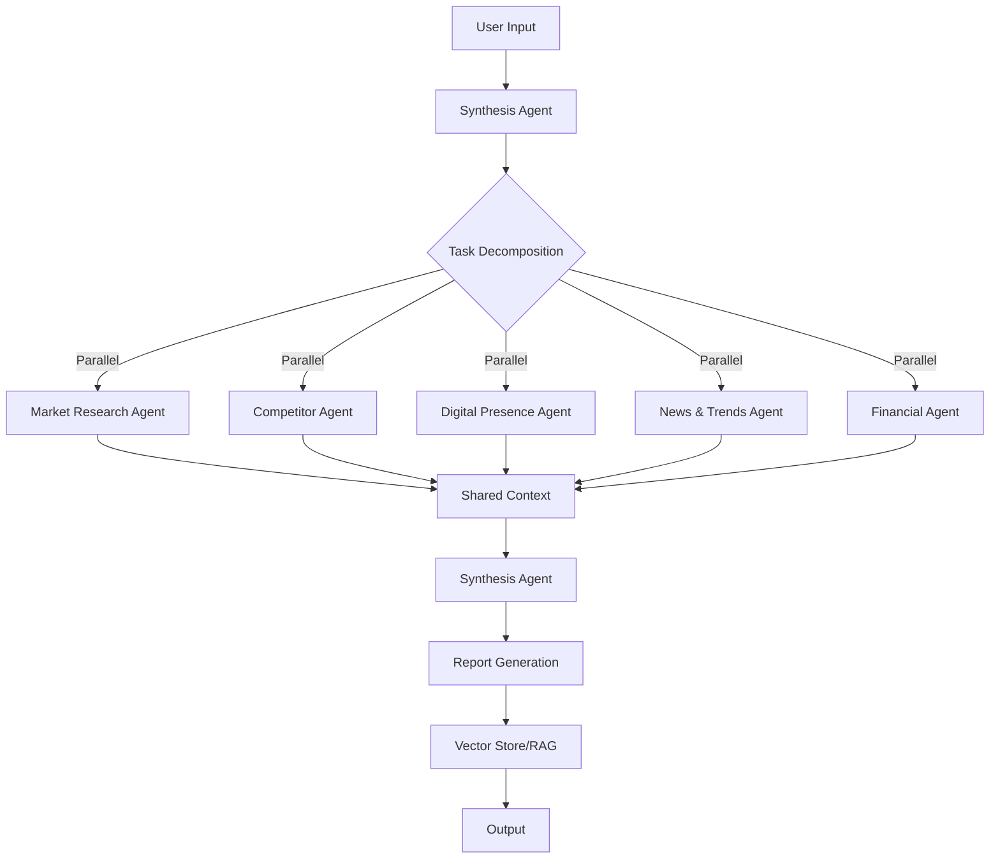
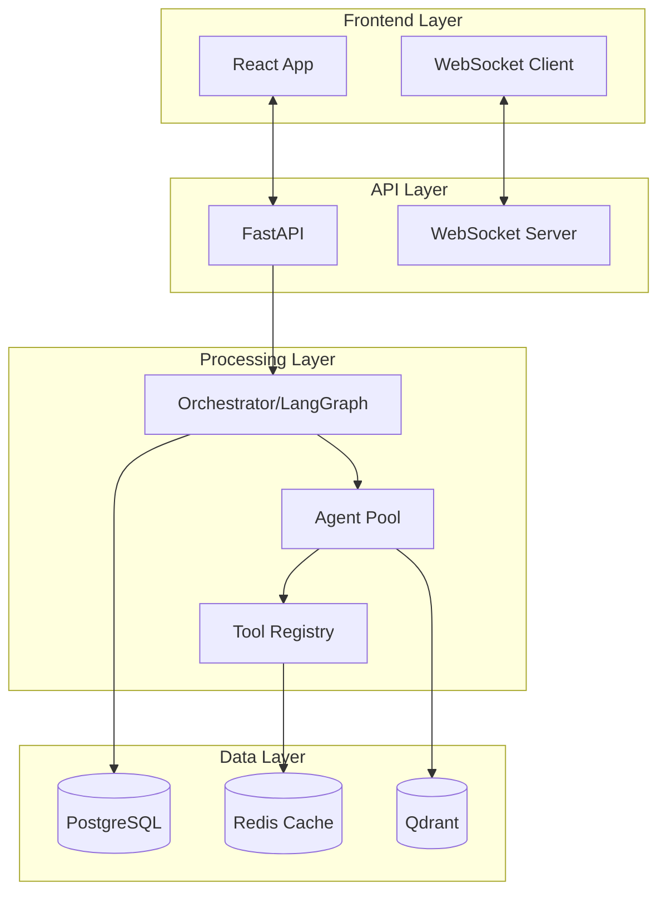

# 🧠 MarketMind - Documentação de Desenvolvimento

## 📋 Objetivo do Projeto

**Desenvolver um sistema multiagente para análise automatizada de mercado que gere relatórios executivos consultando 15+ fontes de dados.**

### Requisitos Funcionais
- [ ] Análise de mercado (tamanho, crescimento, segmentação)
- [ ] Mapeamento de competidores (identificação, análise, posicionamento)
- [ ] Análise de presença digital (redes sociais, SEO, sentiment)
- [ ] Identificação de tendências (notícias, papers, sinais emergentes)
- [ ] Inteligência financeira (investimentos, valuations)
- [ ] Geração de relatório executivo estruturado
- [ ] Sistema RAG para Q&A sobre dados coletados

### Requisitos Não-Funcionais
- [ ] Paralelização: Agentes executam simultaneamente
- [ ] Cache: Reduzir chamadas repetidas de API
- [ ] Rastreabilidade: Toda informação com fonte citada
- [ ] UI real-time: Mostrar progresso dos agentes

## 🏗️ Arquitetura do Sistema

### Fluxo Geral


### Arquitetura de Componentes


## 🤖 Definição dos Agentes

### 1. Synthesis Agent (Orquestrador)
```python
class SynthesisAgent:
    """
    Responsável por:
    - Decompor query em tarefas
    - Coordenar execução paralela
    - Resolver conflitos de dados
    - Gerar insights finais
    """
    
    tools = []  # Não usa tools externas
    llm = "gpt-4-turbo"
    
    def decompose_task(query: str) -> List[Task]:
        # Lógica de decomposição
        pass
    
    def synthesize_results(results: Dict) -> Report:
        # Consolidação e insights
        pass
```

### 2. Market Research Agent
```python
class MarketResearchAgent:
    """
    Coleta: TAM, SAM, SOM, crescimento, segmentação
    """
    tools = [
        "ibge_api",        # Dados BR
        "world_bank_api",  # Dados globais
        "statista_api",    # Estatísticas setoriais
        "web_search"       # Relatórios públicos
    ]
    llm = "gpt-3.5-turbo"
```

### 3. Competitor Agent
```python
class CompetitorAgent:
    """
    Identifica e analisa competidores
    """
    tools = [
        "firecrawl",       # Web scraping
        "similarweb_api",  # Analytics
        "google_places",   # Localização
        "linkedin_api"     # Dados corporativos
    ]
    llm = "gpt-3.5-turbo"
```

## 📦 Estrutura de Diretórios
```
marketmind/
├── backend/
│   ├── agents/
│   │   ├── base.py              # Classe base dos agentes
│   │   ├── synthesis.py         # Orquestrador
│   │   ├── market.py
│   │   ├── competitor.py
│   │   ├── digital.py
│   │   ├── news.py
│   │   └── financial.py
│   ├── tools/
│   │   ├── registry.py          # Registro de ferramentas
│   │   ├── apis/
│   │   │   ├── ibge.py
│   │   │   ├── serpapi.py
│   │   │   ├── newsapi.py
│   │   │   └── ...
│   │   └── scrapers/
│   │       ├── firecrawl.py
│   │       └── beautifulsoup.py
│   ├── core/
│   │   ├── orchestrator.py      # LangGraph
│   │   ├── config.py
│   │   ├── cache.py             # Redis
│   │   └── vectorstore.py       # Qdrant
│   ├── api/
│   │   ├── main.py              # FastAPI
│   │   ├── routes/
│   │   └── websocket.py
│   └── reports/
│       ├── generator.py
│       └── templates/
└── frontend/
    ├── src/
    │   ├── components/
    │   │   ├── AgentStatus.tsx
    │   │   ├── ProgressBar.tsx
    │   │   └── Report.tsx
    │   └── pages/
    └── package.json
```

## 🛠️ Stack de Desenvolvimento

### Backend
| Tecnologia | Versão | Uso | Responsável |
|------------|--------|-----|-------------|
| Python | 3.11+ | Core | Todos |
| FastAPI | 0.104+ | API REST | - |
| LangChain | 0.1.x | Framework LLM | - |
| LangGraph | 0.0.x | Orquestração | - |
| Celery | 5.3+ | Tasks assíncronas | - |
| Redis | 7+ | Cache + Queue | - |
| PostgreSQL | 15+ | Dados persistentes | - |
| Qdrant | 0.4+ | Vector store | - |

### Frontend
| Tecnologia | Versão | Uso | Responsável |
|------------|--------|-----|-------------|
| React | 18+ | UI Framework | - |
| TypeScript | 5+ | Type safety | - |
| TailwindCSS | 3+ | Styling | - |
| shadcn/ui | latest | Components | - |
| Recharts | 2+ | Gráficos | - |
| Socket.io | 4+ | WebSocket | - |

## 🔑 APIs e Integrações

### Tier Gratuito Disponível
```yaml
Essenciais:
  OpenAI:
    - Custo: ~$0.01 por request
    - Uso: LLMs e embeddings
    
  Firecrawl:
    - Free: 500 pages/mês
    - Uso: Scraping de sites
    
  SerpAPI:
    - Free: 100 searches/mês
    - Uso: Google search
    
  NewsAPI:
    - Free: 100 requests/dia
    - Uso: Notícias recentes

Complementares:
  Alpha Vantage:
    - Free: 500 calls/dia
    - Uso: Dados financeiros
    
  Google Trends:
    - Free: Ilimitado (com rate limit)
    - Uso: Tendências
    
  IBGE APIs:
    - Free: Ilimitado
    - Uso: Dados Brasil
    
  Reddit API:
    - Free: 60 req/min
    - Uso: Discussões

Opcionais (melhoram qualidade):
  Crunchbase:
    - Trial: 100 calls
    - Uso: Startups/funding
    
  SimilarWeb:
    - Trial: 50 queries
    - Uso: Analytics
```

## 📅 Cronograma de Desenvolvimento

### SÁBADO (11h de desenvolvimento)

#### Manhã (8h-13h) - 5h - CORE

```mermaid
gantt
    title Sábado Manhã
    dateFormat HH:mm
    section Setup
    Estrutura base      :08:00, 30m
    Configurações       :08:30, 30m
    section Backend Core
    Synthesis Agent     :09:00, 1h
    2 Agentes básicos   :10:00, 2h
    section Integração
    3 APIs principais   :12:00, 1h
```


**Entregáveis Manhã:**
- [ ] Projeto estruturado
- [ ] Synthesis Agent funcional
- [ ] Market + Competitor agents básicos
- [ ] Integração com SerpAPI, NewsAPI, Firecrawl

#### Tarde (14h-19h) - 5h - EXPANSÃO

```mermaid
gantt
    title Sábado Tarde
    dateFormat HH:mm
    section Agentes
    Digital Agent       :14:00, 1h
    News Agent          :15:00, 1h
    Financial Agent     :16:00, 1h
    section Orquestração
    LangGraph setup     :17:00, 1h
    Execução paralela   :18:00, 1h
```


**Entregáveis Tarde:**
- [ ] Todos 5 agentes especializados
- [ ] Orquestração com LangGraph
- [ ] Compartilhamento de contexto
- [ ] Cache Redis básico

### DOMINGO (11h30min de desenvolvimento)

#### Manhã (8h-13h) - 5h - INTERFACE & POLISH

```mermaid
gantt
    title Domingo Manhã
    dateFormat HH:mm
    section Frontend
    Setup React         :08:00, 30m
    Dashboard básico    :08:30, 1h30m
    WebSocket updates   :10:00, 1h
    section Reports
    Template design     :11:00, 1h
    PDF generation      :12:00, 1h
```


**Entregáveis Manhã:**
- [ ] Frontend funcionando
- [ ] Visualização real-time dos agentes
- [ ] Geração de relatório PDF
- [ ] UI polida

#### Tarde (14h-19h30) - 5h30min - FINALIZAÇÃO

```mermaid
gantt
    title Domingo Tarde
    dateFormat HH:mm
    section RAG
    Qdrant setup      :14:00, 1h
    RAG implementation  :15:00, 1h
    section Testing
    Testes integrados   :16:00, 1h
    Ajustes finais      :17:00, 1h
    section Deploy
    Easypanel deploy    :18:00, 30m
    section Apresentação
    Demo prep           :18:30, 30m
    Pitch practice      :19:00, 30m
```


**Entregáveis Tarde:**
- [ ] RAG funcionando
- [ ] Sistema testado end-to-end
- [ ] Deploy em produção
- [ ] Apresentação preparada

## 🧪 Plano de Testes

### Casos de Teste Prioritários

1. **Teste Básico**: "Energia solar em Goiás"
   - Validar todos os agentes retornam dados
   - Tempo < 5 minutos
   - Relatório gerado com sucesso

2. **Teste de Stress**: Executar 3 análises simultâneas
   - Verificar paralelização
   - Monitorar uso de memória
   - Validar cache

3. **Teste de Qualidade**: Comparar com pesquisa manual
   - Precisão dos dados de mercado
   - Competidores identificados corretamente
   - Insights fazem sentido

## 🚨 Riscos e Mitigações

| Risco | Probabilidade | Impacto | Mitigação |
|-------|---------------|---------|-----------|
| Rate limit de APIs | Alta | Alto | Cache agressivo + APIs alternativas |
| LLM hallucination | Média | Alto | Validação cruzada + citação obrigatória |
| Tempo > 5 min | Média | Médio | Timeout + resultado parcial |
| Crash durante demo | Baixa | Alto | Video backup + deploy redundante |


---

**FOCO**: Entregar um MVP funcional que impressione. Better done than perfect! 🚀
