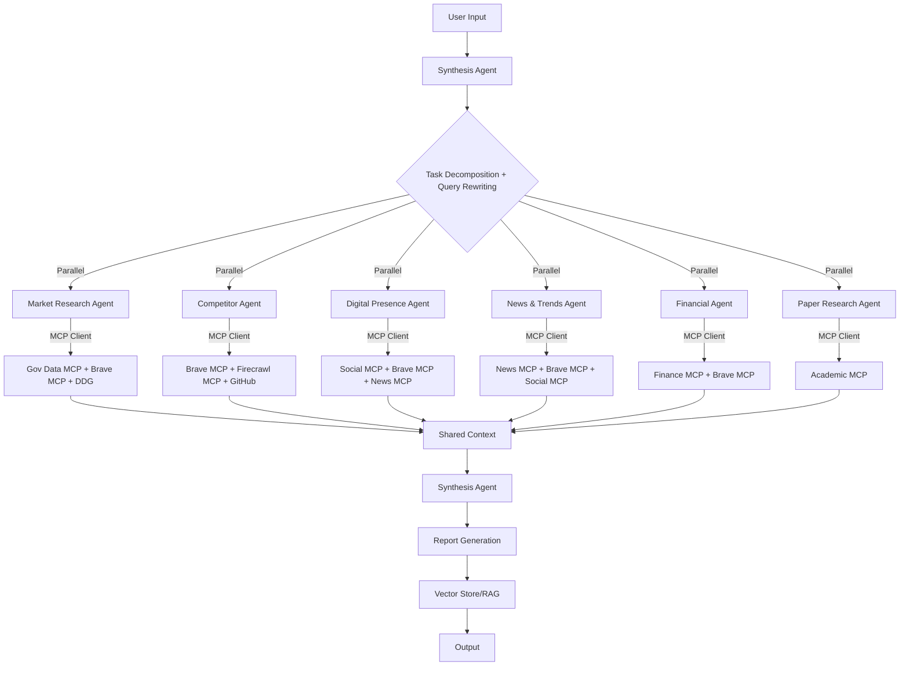
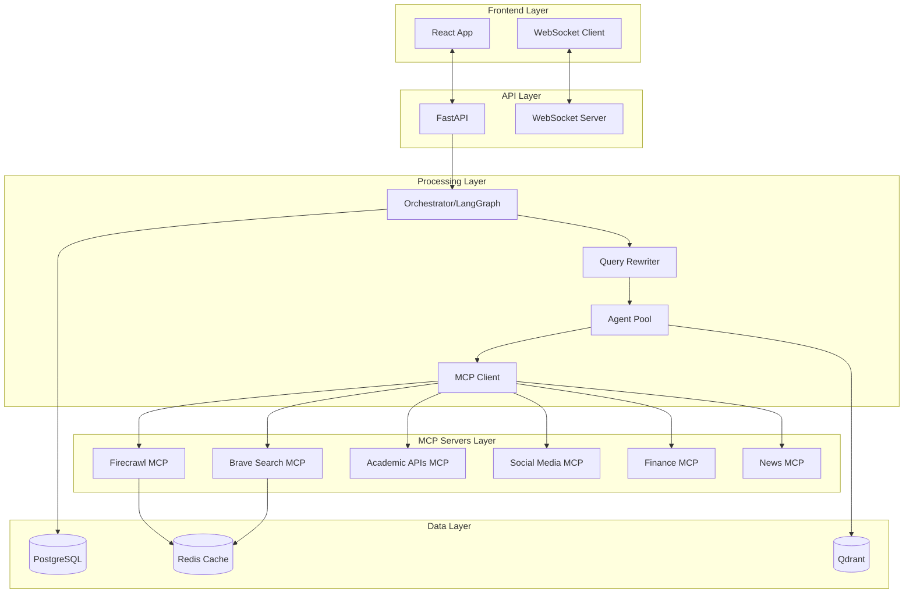
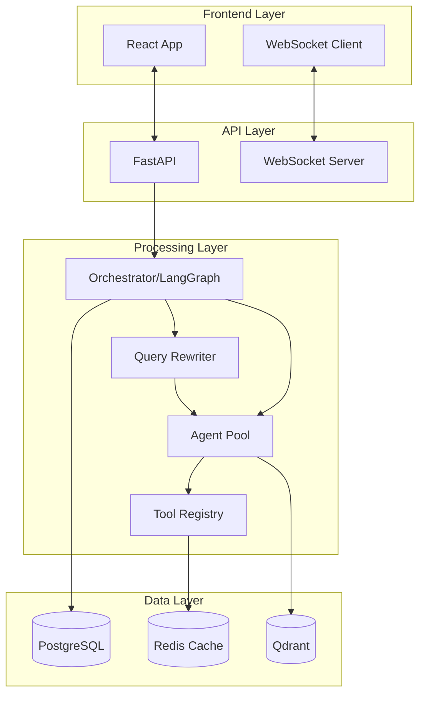

# 🧠 MarketMind - Documentação de Desenvolvimento

## 📋 Objetivo do Projeto

**Desenvolver um sistema multiagente para análise automatizada de mercado que gere relatórios executivos consultando 15+ fontes de dados.**

### Requisitos Funcionais
- [ ] Análise de mercado (tamanho, crescimento, segmentação)
- [ ] Mapeamento de competidores (identificação, análise, posicionamento)
- [ ] Análise de presença digital (redes sociais, SEO, sentiment)
- [ ] Identificação de tendências (notícias, papers, sinais emergentes)
- [ ] Pesquisa acadêmica (papers, estudos científicos, alinhamento com academia)
- [ ] Inteligência financeira (investimentos, valuations)
- [ ] Query rewriting para expansão de contexto
- [ ] Geração de relatório executivo estruturado
- [ ] Sistema RAG para Q&A sobre dados coletados

### Requisitos Não-Funcionais
- [ ] Paralelização: Agentes executam simultaneamente
- [ ] Cache: Reduzir chamadas repetidas de API
- [ ] Rastreabilidade: Toda informação com fonte citada
- [ ] UI real-time: Mostrar progresso dos agentes

## 🏗️ Arquitetura do Sistema

### Fluxo Geral


### Arquitetura de Componentes


### Arquitetura de Componentes


## 🤖 Definição dos Agentes

### 1. Synthesis Agent (Orquestrador)
```python
class SynthesisAgent:
    """
    Responsável por:
    - Decompor query em tarefas
    - Implementar query rewriting para expansão de contexto
    - Coordenar execução paralela
    - Resolver conflitos de dados
    - Gerar insights finais
    """
    
    tools = []  # Não usa tools externas
    llm = "gemini-2.5-flash-lite"
    
    def rewrite_queries(query: str) -> List[str]:
        """
        Gera variações da query original para aumentar cobertura:
        - Reformulação técnica
        - Variações de linguagem
        - Expansão de termos
        - Queries relacionadas
        """
        pass
    
    def decompose_task(query: str, rewritten_queries: List[str]) -> List[Task]:
        # Lógica de decomposição com contexto expandido
        pass
    
    def synthesize_results(results: Dict) -> Report:
        # Consolidação e insights
        pass
```

### 2. Market Research Agent
```python
class MarketResearchAgent:
    """
    Coleta: TAM, SAM, SOM, crescimento, segmentação
    """
    tools = [
        "ibge_api",        # ∞ gratuito - Dados BR
        "world_bank_api",  # ∞ gratuito - Dados globais
        "brave_search",    # 2000 queries/mês gratuito
        "duckduckgo_search", # ∞ gratuito
        "web_scraping"     # Beautiful Soup para sites públicos
    ]
    llm = "gemini-2.5-flash-lite"
```

### 3. Competitor Agent
```python
class CompetitorAgent:
    """
    Identifica e analisa competidores
    """
    tools = [
        "brave_search",    # Busca de competidores
        "duckduckgo_search", # Busca alternativa
        "firecrawl",       # 500 pages/mês gratuito - Web scraping
        "web_scraping",    # Beautiful Soup para sites
        "github_api",      # ∞ gratuito - Análise de repos
    ]
    llm = "gemini-2.5-flash-lite"
```

### 4. Digital Presence Agent
```python
class DigitalPresenceAgent:
    """
    Analisa presença digital e sentiment
    """
    tools = [
        "reddit_api",      # 60 req/min gratuito
        "youtube_api",     # 10k quota/dia gratuito
        "brave_search",    # Análise SEO via busca
        "duckduckgo_search", # Busca alternativa
        "firecrawl",       # Scraping de sites
        "web_scraping",    # Reviews de sites públicos
        "google_trends"    # pytrends - gratuito ilimitado
    ]
    llm = "gemini-2.5-flash-lite"
```

### 5. News & Trends Agent
```python
class NewsTrendsAgent:
    """
    Identifica tendências e notícias recentes
    """
    tools = [
        "newsapi",         # 100 requests/dia gratuito
        "brave_search",    # Notícias via busca
        "duckduckgo_search", # Busca de notícias
        "rss_feeds",       # Gratuito ilimitado
        "google_trends",   # pytrends - gratuito
        "reddit_api"       # Trending topics
    ]
    llm = "gemini-2.5-flash-lite"
```

### 6. Paper Research Agent 🆕
```python
class PaperResearchAgent:
    """
    Busca e analisa papers acadêmicos para:
    - Validar tendências de mercado com evidências científicas
    - Identificar tecnologias emergentes
    - Fornecer embasamento técnico para insights
    - Alinhar análise de mercado com pesquisa acadêmica
    
    Utiliza query rewriting para maximizar cobertura:
    - Termos técnicos vs coloquiais
    - Sinônimos e variações
    - Queries em inglês (maioria dos papers)
    """
    tools = [
        "arxiv_api",           # ∞ gratuito - Papers de CS, Physics, Math
        "semantic_scholar",    # 100 req/5min gratuito - Busca acadêmica geral
        "pubmed_api",          # ∞ gratuito - Papers médicos/biológicos
        "core_api",            # 1000 req/dia gratuito - Open access papers
    ]
    llm = "gemini-2.5-flash-lite"
    
    def rewrite_academic_query(self, query: str) -> List[str]:
        """
        Gera variações acadêmicas da query:
        - Tradução para inglês
        - Termos técnicos
        - Sinônimos científicos
        - Queries relacionadas
        """
        pass
    
    def filter_relevant_papers(self, papers: List[Paper], query: str) -> List[Paper]:
        """
        Filtra papers por relevância, recência e citações
        """
        pass
    
    def extract_insights(self, papers: List[Paper]) -> Dict:
        """
        Extrai insights dos papers:
        - Tendências tecnológicas
        - Validação científica de claims
        - Gaps de pesquisa = oportunidades
        """
        pass
```

### 7. Financial Agent
```python
class FinancialAgent:
    """
    Coleta inteligência financeira
    """
    tools = [
        "yahoo_finance",   # yfinance lib - gratuito ilimitado
        "alpha_vantage",   # 500 calls/dia gratuito
        "polygon_api",     # 5 calls/min gratuito
        "brave_search",    # Funding via busca
        "duckduckgo_search", # Notícias financeiras
    ]
    llm = "gemini-2.5-flash-lite"
```

## 🔌 Integração via MCP Server

Para facilitar o acesso às APIs externas, o MarketMind utiliza um **MCP (Model Context Protocol) Server** que centraliza as chamadas às ferramentas externas. O MCP Server expõe as tools via API HTTP, permitindo que os agentes Python acessem múltiplas fontes de dados de forma padronizada.

### Configuração MCP
```python
# backend/config/mcp_config.py
MCP_SERVER_URL = "https://mcp.marketmind.io/execute"
MCP_SERVER_TOKEN = os.getenv("MCP_SERVER_TOKEN")

# Tools disponíveis via MCP
MCP_TOOLS = [
    "brave_search", "firecrawl", "arxiv_api", "semantic_scholar",
    "pubmed_api", "ibge_api", "world_bank_api", "reddit_api",
    "youtube_api", "newsapi", "alpha_vantage", "yahoo_finance"
]
```

### Cliente MCP
```python
# backend/tools/mcp_client.py
class MCPClient:
    """Cliente para acessar tools via MCP Server"""
    
    async def call_tool(self, tool_name: str, params: dict) -> dict:
        """Faz chamada HTTP para MCP Server"""
        async with aiohttp.ClientSession() as session:
            response = await session.post(
                MCP_SERVER_URL,
                json={"tool": tool_name, "parameters": params},
                headers={"Authorization": f"Bearer {MCP_SERVER_TOKEN}"}
            )
            return await response.json()
```

As ferramentas Python nativas (DuckDuckGo, Beautiful Soup, pytrends) continuam sendo acessadas diretamente, sem passar pelo MCP.

## 📦 Estrutura de Diretórios
```
marketmind/
├── backend/
│   ├── agents/
│   │   ├── base.py              # Classe base dos agentes
│   │   ├── synthesis.py         # Orquestrador + Query Rewriting
│   │   ├── market.py
│   │   ├── competitor.py
│   │   ├── digital.py
│   │   ├── news.py
│   │   ├── paper_research.py    # 🆕 Agente de Papers
│   │   └── financial.py
│   ├── tools/
│   │   ├── registry.py          # Registro de ferramentas
│   │   ├── mcp_client.py        # 🆕 Cliente MCP
│   │   ├── apis/
│   │   │   ├── duckduckgo.py    # Python direto
│   │   │   ├── beautifulsoup.py # Python direto
│   │   │   └── pytrends.py      # Python direto
│   │   └── github.py            # GitHub API (opcional)
│   ├── core/
│   │   ├── orchestrator.py      # LangGraph
│   │   ├── query_rewriter.py    # 🆕 Query Rewriting
│   │   ├── config.py
│   │   ├── cache.py             # Redis
│   │   └── vectorstore.py       # Qdrant
│   ├── api/
│   │   ├── main.py              # FastAPI
│   │   ├── routes/
│   │   └── websocket.py
│   └── reports/
│       ├── generator.py
│       └── templates/
└── frontend/
    ├── src/
    │   ├── components/
    │   │   ├── AgentStatus.tsx
    │   │   ├── ProgressBar.tsx
    │   │   └── Report.tsx
    │   └── pages/
    └── package.json
```

## 🛠️ Stack de Desenvolvimento

### Backend
| Tecnologia | Versão | Uso | Responsável |
|------------|--------|-----|-------------|
| Python | 3.11+ | Core | Todos |
| FastAPI | 0.104+ | API REST | - |
| LangChain | 0.1.x | Framework LLM | - |
| LangGraph | 0.0.x | Orquestração | - |
| Celery | 5.3+ | Tasks assíncronas | - |
| Redis | 7+ | Cache + Queue | - |
| PostgreSQL | 15+ | Dados persistentes | - |
| Qdrant | 0.4+ | Vector store | - |
| Beautiful Soup | 4.12+ | Web scraping | - |
| Requests | 2.31+ | HTTP client | - |
| duckduckgo-search | 6+ | DuckDuckGo API | - |
| pytrends | 4.9+ | Google Trends | - |
| feedparser | 6.0+ | RSS feeds | - |
| yfinance | 0.2+ | Yahoo Finance | - |

### Frontend
| Tecnologia | Versão | Uso | Responsável |
|------------|--------|-----|-------------|
| React | 18+ | UI Framework | - |
| TypeScript | 5+ | Type safety | - |
| TailwindCSS | 3+ | Styling | - |
| shadcn/ui | latest | Components | - |
| Recharts | 2+ | Gráficos | - |
| Socket.io | 4+ | WebSocket | - |

## 🔑 APIs e Integrações

### Tier Gratuito Disponível
```yaml
Essenciais:
  Gemini:
    - Custo: ~$0.01 por request
    - Uso: LLMs e embeddings
  
  MCP Server:
    - Custo: $0.00 (agrupa APIs gratuitas)
    - Uso: Acesso centralizado a múltiplas APIs
    - Ferramentas: Brave, Firecrawl, APIs acadêmicas, sociais, financeiras

Papers/Academia (via MCP):
  arXiv API:
    - Free: Ilimitado
    - Uso: Papers de CS, Physics, Math
    
  Semantic Scholar:
    - Free: 100 req/5min
    - Uso: Busca acadêmica + citações
    
  PubMed API:
    - Free: Ilimitado (com rate limit)
    - Uso: Papers médicos/biológicos
    
  CORE API:
    - Free: 1000 req/dia
    - Uso: Open access papers

Complementares (via MCP):
  Brave Search:
    - Free: 2000 queries/mês
    - Uso: Web search
  
  Firecrawl:
    - Free: 500 pages/mês
    - Uso: Web scraping avançado
  
  Alpha Vantage:
    - Free: 500 calls/dia
    - Uso: Dados financeiros
    
  NewsAPI:
    - Free: 100 req/dia
    - Uso: Notícias recentes
    
  Reddit API:
    - Free: 60 req/min
    - Uso: Discussões
  
  YouTube API:
    - Free: 10k quota/dia
    - Uso: Vídeos

Python Nativo (sem MCP):
  DuckDuckGo Search:
    - Free: Ilimitado
    - Uso: Web search
    
  Google Trends:
    - Free: Ilimitado (rate limit)
    - Uso: Tendências
  
  IBGE APIs:
    - Free: Ilimitado
    - Uso: Dados Brasil
  
  Yahoo Finance:
    - Free: Ilimitado
    - Library: yfinance
    - Uso: Dados financeiros
```

## 📅 Cronograma de Desenvolvimento

### SÁBADO (11h de desenvolvimento)

#### Manhã (8h-13h) - 5h - CORE


**Entregáveis Manhã:**
- [ ] Projeto estruturado
- [ ] MCP Client funcionando
- [ ] Synthesis Agent com query rewriting
- [ ] Market + Competitor agents básicos
- [ ] Integração com 3 tools via MCP

#### Tarde (14h-19h) - 5h - EXPANSÃO

```mermaid
gantt
    title Sábado Tarde
    dateFormat HH:mm
    section Agentes
    Digital Agent       :14:00, 1h
    News Agent          :15:00, 45m
    Paper Research Agent :15:45, 1h15m
    Financial Agent     :17:00, 45m
    section Orquestração
    LangGraph setup     :17:45, 45m
    Execução paralela   :18:30, 30m
```


**Entregáveis Tarde:**
- [ ] Todos 6 agentes especializados (incluindo Paper Research)
- [ ] Orquestração com LangGraph
- [ ] Query rewriting implementado
- [ ] Integração com todas tools via MCP
- [ ] Compartilhamento de contexto
- [ ] Cache Redis básico

### DOMINGO (11h30min de desenvolvimento)

#### Manhã (8h-13h) - 5h - INTERFACE & POLISH

```mermaid
gantt
    title Domingo Manhã
    dateFormat HH:mm
    section Frontend
    Setup React         :08:00, 30m
    Dashboard básico    :08:30, 1h30m
    WebSocket updates   :10:00, 1h
    section Reports
    Template design     :11:00, 1h
    PDF generation      :12:00, 1h
```


**Entregáveis Manhã:**
- [ ] Frontend funcionando
- [ ] Visualização real-time dos agentes (incluindo Paper Research)
- [ ] Geração de relatório PDF com seção acadêmica
- [ ] UI polida

#### Tarde (14h-19h30) - 5h30min - FINALIZAÇÃO

```mermaid
gantt
    title Domingo Tarde
    dateFormat HH:mm
    section RAG
    Qdrant setup      :14:00, 1h
    RAG implementation  :15:00, 1h
    section Testing
    Testes integrados   :16:00, 1h
    Ajustes finais      :17:00, 1h
    section Deploy
    Easypanel deploy    :18:00, 30m
    section Apresentação
    Demo prep           :18:30, 30m
    Pitch practice      :19:00, 30m
```


**Entregáveis Tarde:**
- [ ] RAG funcionando (incluindo papers no vector store)
- [ ] Sistema testado end-to-end
- [ ] Deploy em produção
- [ ] Apresentação preparada

## 🧪 Plano de Testes

### Casos de Teste Prioritários

1. **Teste Básico**: "Energia solar em Goiás"
   - Validar todos os agentes retornam dados
   - Paper Research Agent encontra papers relevantes
   - Tempo < 5 minutos
   - Relatório gerado com seção acadêmica

2. **Teste Query Rewriting**: Verificar expansão de contexto
   - Query original gera 3-5 variações
   - Variações capturam dados complementares
   - Papers encontrados são relevantes

3. **Teste de Stress**: Executar 3 análises simultâneas
   - Verificar paralelização
   - Monitorar uso de memória
   - Validar cache

4. **Teste de Qualidade**: Comparar com pesquisa manual
   - Precisão dos dados de mercado
   - Competidores identificados corretamente
   - Papers são relevantes e recentes
   - Insights fazem sentido

## 🚨 Riscos e Mitigações

| Risco | Probabilidade | Impacto | Mitigação |
|-------|---------------|---------|-----------|
| Rate limit de APIs gratuitas | Média | Médio | Cache agressivo + múltiplas fontes alternativas |
| LLM hallucination | Média | Alto | Validação cruzada + citação obrigatória |
| Papers irrelevantes | Média | Médio | Filtros de relevância + threshold de citações |
| Tempo > 5 min | Média | Médio | Timeout + resultado parcial |
| Query rewriting ineficaz | Baixa | Médio | Prompts bem calibrados + exemplos |
| Crash durante demo | Baixa | Alto | Video backup + deploy redundante |
| MCP Server indisponível | Baixa | Médio | Fallback para tools Python nativas |

## 💡 Benefícios do Paper Research Agent

### Para o Sistema
- ✅ **Validação Científica**: Claims de mercado validados com papers
- ✅ **Contexto Expandido**: Query rewriting aumenta cobertura de dados
- ✅ **Diferencial Competitivo**: Poucos sistemas integram academia + mercado
- ✅ **Identificação de Trends**: Papers mostram tecnologias antes do mercado
- ✅ **Zero Custo**: APIs acadêmicas são 100% gratuitas

### Para o Relatório
- 📊 **Seção "Evidências Acadêmicas"**: Papers relevantes citados
- 🔬 **Validação Técnica**: Insights embasados cientificamente
- 🚀 **Tecnologias Emergentes**: Pesquisas apontam futuro do setor
- 📈 **Gaps de Pesquisa**: Oportunidades de mercado não exploradas

---

**FOCO**: Entregar um MVP funcional que impressione. Better done than perfect! 🚀
